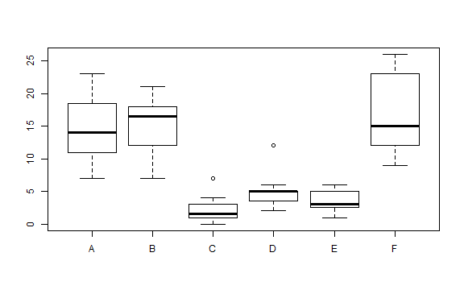
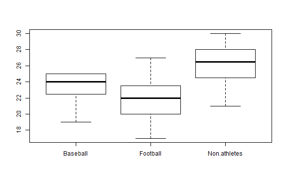
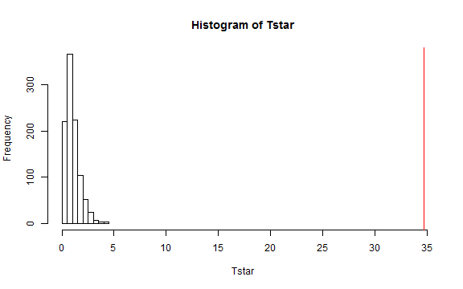
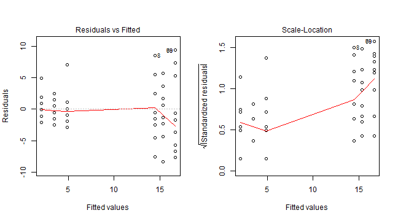
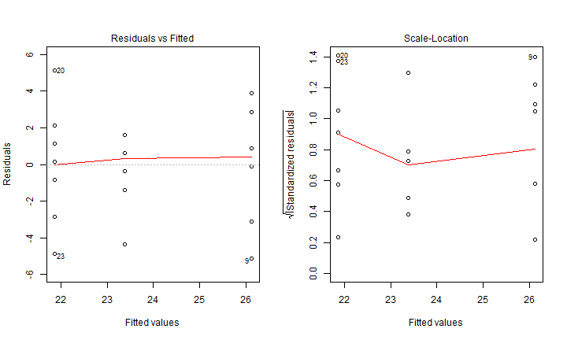
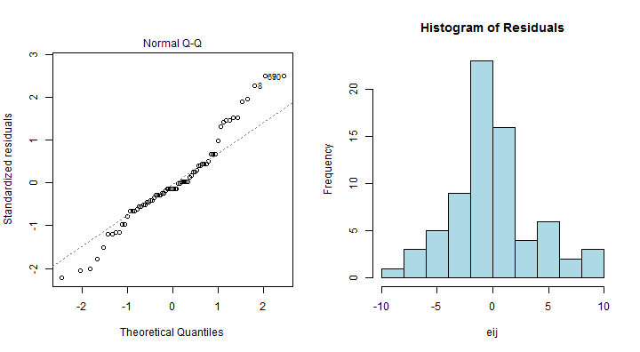
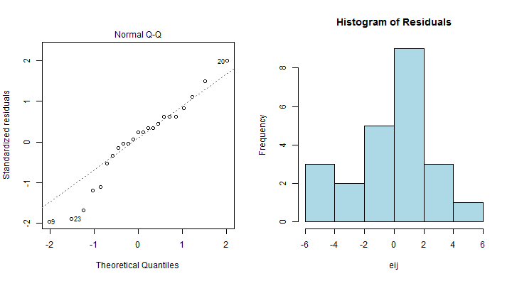

## Introduction

We will continue working on the Insect Sprays and ACT data.  In this activity, we will set up the hypotheses using reference coding.  This time, we will assess the assumptions and then proceed using a permutation test.

Upon completing this activity, you should be comfortable

* Estimating different coefficients in the model
* Assessing the assumptions for a One-Way ANOVA with diagnostic plots (*Step 2 of the Six Steps of Hypothesis Testing*)
* Performing a permutation test in a One-Way ANOVA setting

The "Show Answer" button still does not work.  My apologies.

The questions to turn in to me are not all at the end this time.  I tried to label them "Take Home Questions" throughout the activity.  There should be 12 total (8 from the previous activity and 4 from this one).  Please do not forget any.

---
## The Insect Sprays Data

Recall the Insect Sprays data.  Plots of land were sprayed with one of six insecticides and the number of bugs were counted in each plot after spraying.  The data are displayed below.


```r
data(InsectSprays)  # load the data
boxplot(count ~ spray, data = InsectSprays)
```



---
## Visualizing the ACT Data
A school is interested in comparing ACT scores for students with baseball scholarships, football scholarships, and non-athletes.  We will test at an $\alpha = 0.05$ significance level.  The data are plotted below.


```r
act <- read.csv("act.csv")
boxplot(ACT ~ Sport, data = act)
```




---

## Hypotheses for Insect Sprays Data

We will use a permutation test to analyze the Insect Sprays Data.  The hypotheses for this test are:

$H_0: \mu_1 = \mu_2 = \ldots = \mu_6$

$H_A:$ at least one mean is different from the others

**OR**

$H_0: \tau_1 = \tau_2 = \ldots = \tau_6 = 0$

$H_A:$ at least one $\tau_j$ is not equal to zero

Either set of hypotheses is acceptable.

--- &radio
## Hypotheses for ACT Data

Which of the following is a valid set of hypotheses for the ACT Data?  What type of coding does it correspond to?

1. $H_0: \mu_1 = \mu_2 = \mu_3$;
$H_A:$ at least one $\mu_j$ is not equal to the others;
This is called "reference coding"

2. $H_0: \tau_1 = \tau_2 = \tau_3 = 0;$
$H_A:$ at least one $\tau_j$ is not equal to zero; 
This is called "reference coding"

3. $H_0: \mu_1 = \mu_2 = \mu_3;$
$H_A:$ at least one $\mu_j$ is not equal to the others; 
This is called "cell means coding"

4. $H_0: \tau_1 = \tau_2 = \tau_3 = 0;$
$H_A:$ at least one $\tau_j$ is not equal to zero;
This is called "cell means coding"

5. _Either the second or third choice is valid_

*** .hint
For the Insect Sprays data, which set of hypotheses corresponded to cell means coding?  Which corresponded to reference coding?

*** .explanation
The hypotheses using $\mu$ are for cell means coding.  The hypotheses using $\tau$ are for reference coding.

---
## Test Statistic for Insect Sprays Data

To get our test statistic, we need to obtain the ANOVA table.  This can be done using the following R code.


```r
lm1 <- lm(count ~ spray, data = InsectSprays)
anova(lm1)
```

```
#> Analysis of Variance Table
#> 
#> Response: count
#>           Df Sum Sq Mean Sq F value Pr(>F)
#> spray      5   2669     534    34.7 <2e-16
#> Residuals 66   1015      15
```

We want to use the F-statistic as our test statistic.  The following R code will extract it.


```r
Tobs <- anova(lm1)[1,4]
Tobs
```

```
#> [1] 35
```

--- &multitext
## Test Statistic for ACT Data


```r
lm2 <- lm(ACT ~ Sport, data = act)
anova(lm2)
```

```
#> Analysis of Variance Table
#> 
#> Response: ACT
#>           Df Sum Sq Mean Sq F value Pr(>F)
#> Sport      2     71    35.5    4.56  0.023
#> Residuals 20    156     7.8
```

```r
Tobs2 <- anova(lm2)[1,4]
```

1. What will test test statistic for the ACT data be?

*** .hint
Again, we want to use the F-value as our test statistic.

*** .explanation
1. <span class='answer'>4.56</span>

---
## Permutations for Insect Sprays

We will use a `for` loop to permute the data 1000 times.  Each time we'll `shuffle` or permute the data to get a permuted test statistic.  I'll create a matrix called `Tstar` to store the permuted test statistics.

If you want to learn more about this code, please ask.


```r
require(mosaic)
Tstar <- matrix(NA, nrow = 1000)
for(i in 1:1000) {
  lm_i <- lm(count ~ shuffle(spray), data = InsectSprays)
  Tstar[i] <- anova(lm_i)[1,4]
}
```

`Tstar` now contains the permuted test statistics.  The first one is 0.36, the second one is 0.21, and so on...


```r
head(Tstar)
```

```
#>      [,1]
#> [1,] 0.36
#> [2,] 0.21
#> [3,] 0.75
#> [4,] 2.10
#> [5,] 1.82
#> [6,] 0.66
```

--- &multitext
## Permutations for ACT Data

Here is the code to perform the permutations for the ACT data.


```r
Tstar2 <- matrix(NA, nrow = 1000)
for(i in 1:1000) {
  lm_i <- lm(ACT ~ shuffle(Sport), data = act)
  Tstar2[i] <- anova(lm_i)[1,4]
}
head(Tstar2)
```

```
#>      [,1]
#> [1,] 2.99
#> [2,] 0.50
#> [3,] 5.10
#> [4,] 0.14
#> [5,] 1.38
#> [6,] 1.14
```

1. In the first permutation, what was the test statistic?  Round to two decimal places.
2. What was the test statistic for the second permutation?  Round to two decimal places.

*** .hint
The permuted test statistics are stored in `Tstar`

*** .explanation
1. <span class='answer'>2.99</span>
2. <span class='answer'>0.5</span>

---
## P-value for Insect Sprays

We create a histogram of the distribution of permuted test statistics.  The red line represents our observed test statistic.


```r
hist(Tstar, xlim = c(0, Tobs))
abline(v = Tobs, col = "red")
```



The `pdata` command is then used to find the proportion of permuted test statistics greater than our observed test statistic.  It tells us that our p-value is approximately 0.


```r
pdata(Tobs, Tstar, lower.tail = F)
```

```
#> [1] 0
```

---
## P-value for ACT Data


The same process can be used to calculated a p-value for the ACT data.  The histogram is displayed below.  The number corresponds to the percent of the null distribution in each bin.  The red line indicates the observed result.


--- &radio

## Calculating a p-value for the ACT Data

Do we use the left-tail or right-tail of the null distribution to find the p-value?  Approximately what is the p-value?

1. Left; 0.98 
2. Left; 0.02
3. Right; 0.98
4. _Right; 0.02_

*** .hint
Once you've decided on the correct tail, just sum the probabilities and divide by 100 to get an approximate p-value.

*** .explanation
We use the right tail when doing an ANOVA for both F-tests (parametric) and permutation tests (non-parametric).  Summing from right to left, the p-value $\approx (1.2 + 1) / 100 \approx 0.02$ which is the sum of the probability in each bin to the right of the observed result.


---

## Equal Variance for Insect Sprays

Let's first look at the equal variance assumption.  These plots suggest problems with the equal variance assumption.  Small fitted values do not have much spread, but large fitted values have a lot of spread in the residuals.  We see a fan shape in the Residuals vs Fitted values plot and an increasing trend in the Scale-Location plot.  So this assumption is not met.


```r
par(mfrow = c(1,2))
plot(lm1, which = c(1,3))
```



---

## Equal Variance Plots for ACT Data

The Residuals vs Fitted value plot is on the left.  The Scale-Location plot is on the right.



--- &radio

## Assessing Equal Variance for the ACT Data

Is the equal variance assumption met for the ACT data?

1. Yes - there are noticeable patterns in the plots
2. No - there are no noticeable patterns in the plots
3. _Yes - there are no noticable patterns in the plots_
4. No - there are noticeable patterns in the plots

*** .hint
If there is a U-shape or fanning in the Residuals vs Fitted values plot **or** a constant upward/downward trend in the Scale-Location plot, the equal variance assumption is violated.

*** .explanation
There are no obvious patterns in the plots, so the equal variance assumption is met.

---

## Normality for Insect Sprays

Now let's look at normality.  Here, there are some problems.  We see the points flying off the line in the tails of the Normal Q-Q plot.  This is suggests that the data are not normally distributed so this assumption is not met.



---
## Normality Plots for the ACT Data

The Normal Q-Q plot is located on the left.  A histogram of the residuals is located on the right.  We have a small sample size for the ACT data (only 7 or 8 observations per group) so we need the plots to look really good.  There are some points lying well below the line on the Normal Q-Q plot, and the histogram is not quite symmetric so this assumption is violated.



---
## Additional Take Home Questions

9)  Draw a Residuals vs Fitted values plot which shows that the Equal Variance assumption is violated (this will be easiest if you give the residuals a fan shape).

10)  Draw a Residuals vs Fitted values plot which shows that the Equal Variance assumption is met

11)  Draw a Normal Q-Q plot which shows that the Normality assumption is violated.

12)  Draw a Normal Q-Q plot which shows that the Normality assumption is met.


